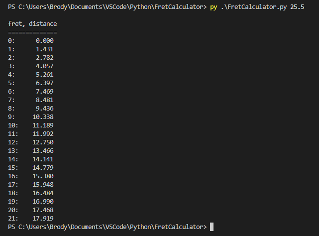

# Fret Calculator

This program calculates the fret distances for a stringed instrument relative to the nut (0ᵗʰ fret). It takes two argument: the scale length (i.e. total length of the string) and an optional argument of the number of frets to calculate (defult is 22 frets). The distances are based on the modern equal-temperament tuning system, though other systems may be added in the future.

## Example Usage

Below is a screenshot of the program running. I measured a 3/4 size classical guitar and its strings are 25.5 inches long, so I entered the number 25.5. Units don't matter. The output will be in the same units as what you put in. By default, it outputs answers to 3 decimal places, so it is best to use inches, centimeters, or millimeters

